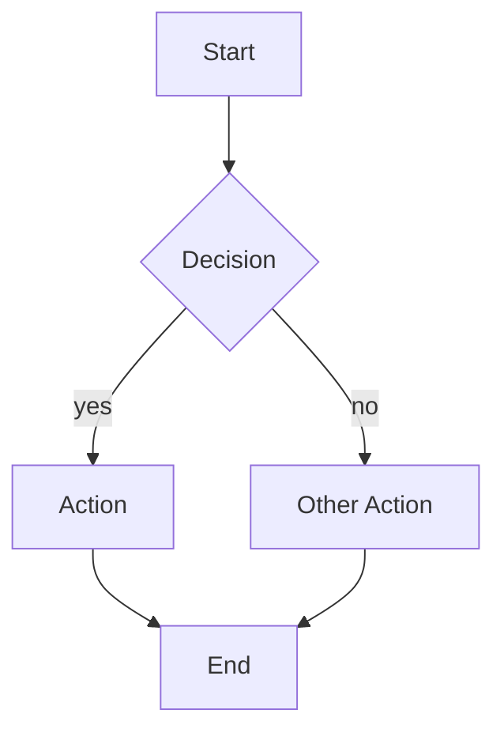
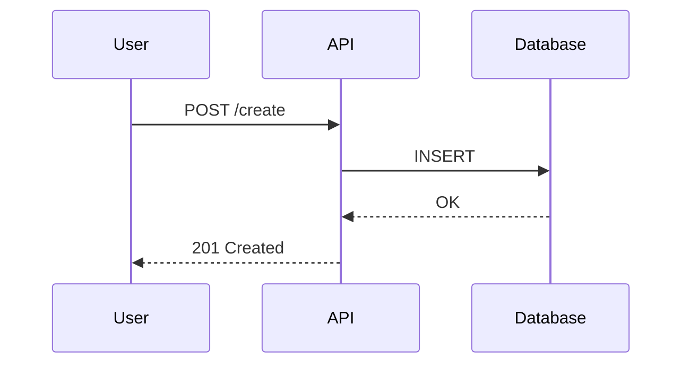
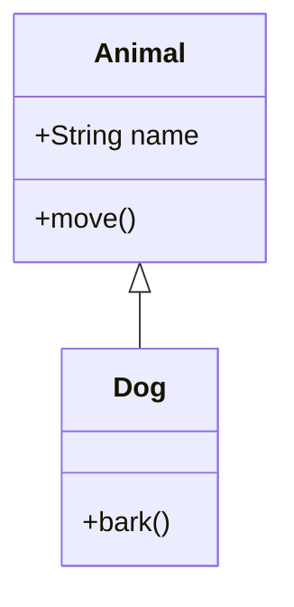
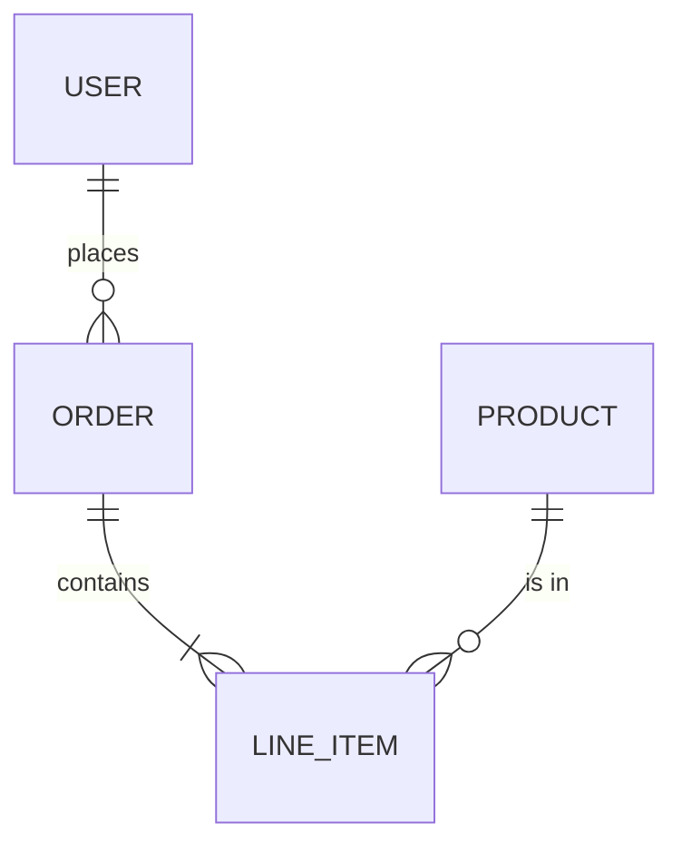
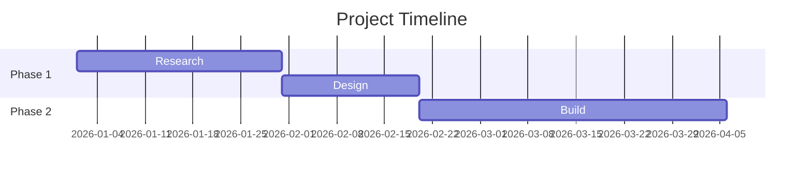

# Mermaid DSL Reference

## Flowchart

## Sequence Diagram

## Class Diagram

## ER Diagram

## Gantt Chart

## Known LLM Pitfalls
- Parentheses in labels: use `A["label (detail)"]` with quotes
- Special characters in edge labels: wrap in quotes
- `architecture-beta`: unreliable, prefer D2
- Subgraph nesting >2 levels: often malformed
